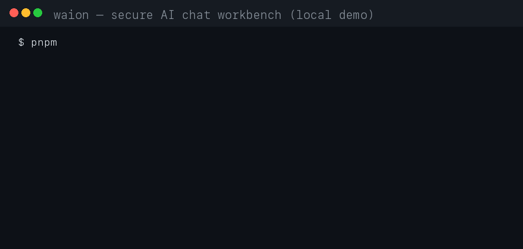

# AI Startup Web Application

Security-first AI chat application built with Next.js 16 (App Router), TypeScript, Tailwind CSS, PostgreSQL, and better-auth.

## Prerequisites

- Node.js 22+ (verified on 24)
- PostgreSQL 16 (docker compose for local dev, see Phase 3)

## Getting Started

```bash
npm install
cp .env.example .env.local   # then fill in real values (never commit .env.local)
npm run dev
```

Open http://localhost:3000.

> `AUTH_SECRET` and `AI_API_KEY` are server-side secrets. Generate with
> `openssl rand -base64 32`. Keep them out of git at all times.

## Commands

| Command | Purpose |
| --- | --- |
| `npm run dev` | Development server (Turbopack) |
| `npm run build` | Production build + typecheck |
| `npm start` | Run production build (after `npm run build`) |
| `npm run lint` | ESLint |
| `npx tsc --noEmit` | TypeScript check |
| `npm run db:generate` / `db:migrate` | Generate / apply Drizzle migrations |
| `npm run db:verify` | Test DB connectivity |
| `npm run create-admin` | Bootstrap an admin user (app must be running) |
| `npm audit` | Dependency vulnerability check |

## Security

See `SECURITY.md` and `SECURITY_AUDIT.md` (created in Phase 10) for the security
architecture, threat model, and audit results. Key rules:

- No secrets in the repository. Never commit `.env*`.
- All authn/authz enforced server-side. The frontend is never trusted.
- AI provider keys live only in server-side environment variables.
- See `AGENTS.md` before writing code — this repo pins Next.js 16, which has
  breaking changes vs. older versions (e.g. `proxy.ts` replaces `middleware.ts`).

---

## Demo



## Contributors

Thanks to everyone who builds with this project! 🙏

<a href="https://github.com/irwanformal-cmd">
  
</a>

**[@irwanformal-cmd](https://github.com/irwanformal-cmd)** — creator & maintainer
